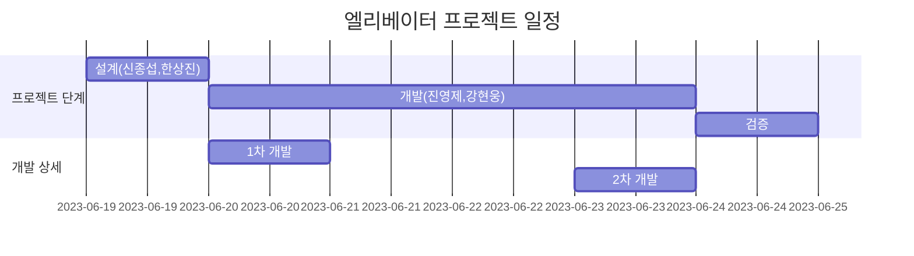
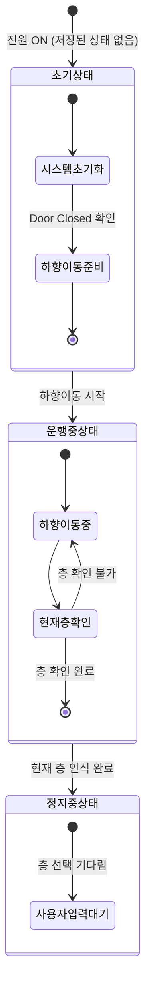
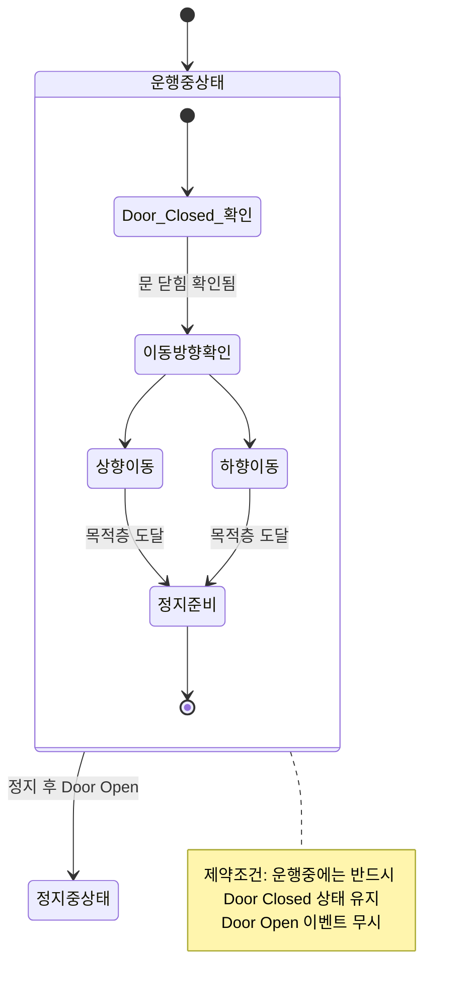
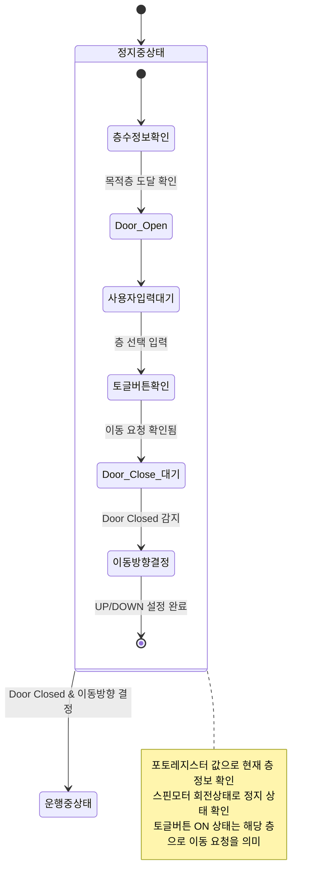

# 엘리베이터 토이 프로젝트

이 문서는 STM32 보드 기반 엘리베이터 토이 프로젝트


## 프로젝트 일정




<br>
<br>


## 엘리베이터 상태 (Elevator States)

엘리베이터는 다음과 같은 3가지 메인 상태를 가집니다:

1. **초기상태(Power On)** - 시스템이 시작되는 초기 상태
2. **운행중상태** - 엘리베이터가 이동 중인 상태
3. **정지중상태** - 엘리베이터가 멈춰있는 상태

``` C
enum ELEVATOR_STATE{
  ELEVATOR_STATE_INIT,
  ELEVATOR_STATE_MOVING,
  ELEVATOR_STATE_STOP,
};


[Received input Event]
#1.Photo Event : 1F(GPIO_PIN_10), 2F(GPIO_PIN_3), 3F(GPIO_PIN_5)
   ==> ? 확인
#2.Button Event : 1F(GPIO_PIN_8), 2F(GPIO_PIN_6), 3F(GPIO_PIN_5)
   ==> ? Toggle On 상태 정보 기억
#3.Door open/close : Open (GPIO_PIN_12), Close (GPIO_PIN_11)

```


## 초기상태 다이어그램



### 초기상태 동작 설명

1. **저장장치 제약사항**: STM32 시스템은 전원이 꺼지면 이전 상태 정보가 손실됨
2. **초기화 과정**: 전원 ON 시 초기상태로 진입하여 시스템 초기화
3. **이동 시작**: Main 함수 진입 후 Door Closed 상태 확인 후 하향으로 이동
4. **현재 위치 파악**: 엘리베이터가 현재 층을 인식할 때까지 하향 이동 지속
5. **대기 상태 전환**: 현재 층 인식 완료 시 정지중상태로 전환하여 사용자 입력 대기


## 운행중상태 다이어그램



### 운행중상태 동작 설명

1. **상태 확인 방식**: 각 층에 설치된 포토레지스터를 통해 엘리베이터 운행 상태 확인
2. **층 인식 과정**: 포토레지스터 값으로 층 통과 감지 및 각 층 토글버튼 상태 확인
3. **이동 방향**: 내부 설정값(UP/DOWN)을 통해 이동 방향 결정
4. **정지 조건**: 이동 중 해당 층 토글버튼이 ON 상태라면 해당 층에서 정지 후 Door Open
5. **안전 제약**: 운행중 상태에서는 문이 항상 닫혀 있어야 하며, Door Open 이벤트 무시

## 정지중상태 다이어그램



### 정지중상태 동작 설명

1. **상태 감지 방식**: 포토레지스터 값과 스핀모터의 회전상태로 정지 상태 확인
2. **층 정보 확인**: 엘리베이터가 정지한 현재 층의 정보를 포토레지스터를 통해 확인
3. **사용자 입력 처리**: 각 층의 토글버튼 ON 상태를 확인하여 이동 요청 처리
4. **문 동작 순서**: 목적층 도달 시 Door Open → 사용자 입력 대기 → Door Closed
5. **이동 방향 결정**: 현재 층과 토글버튼 값을 비교하여 UP/DOWN 이동 방향 결정
6. **상태 전환 조건**: Door Closed 상태 확인 및 토글버튼 ON 감지 시 운행중상태로 전환


