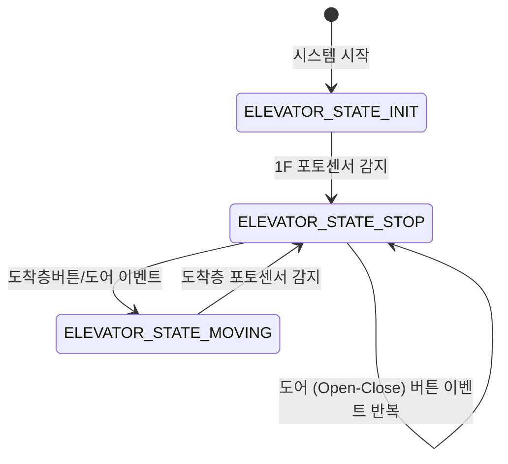
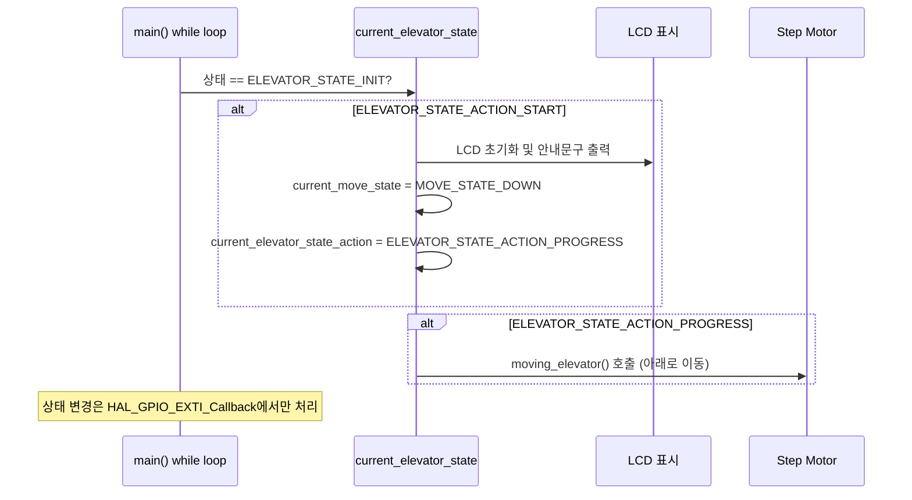
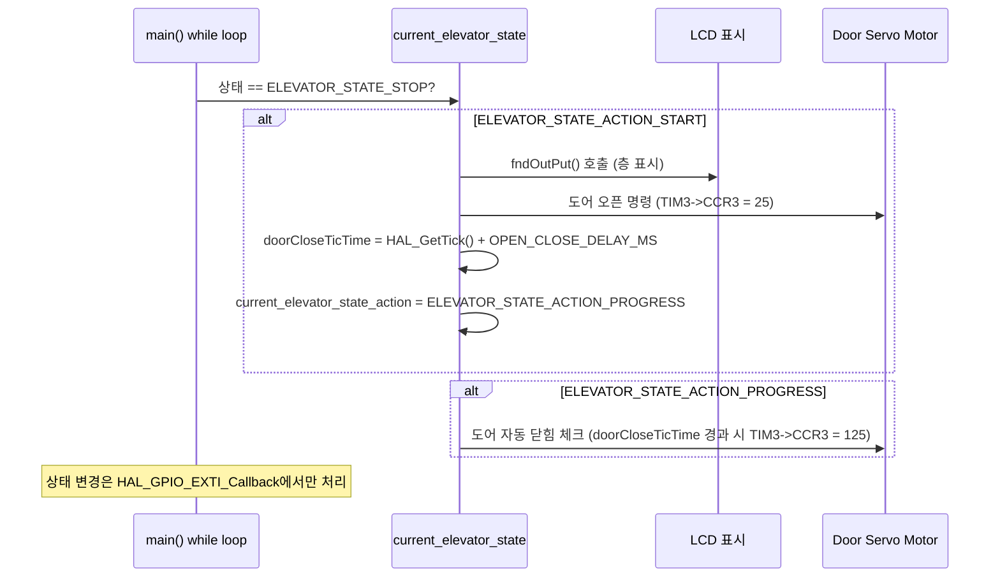
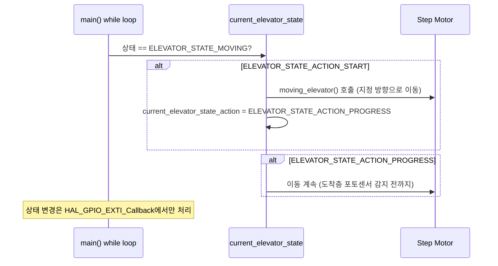

## 엘리베이터 상태(State) 다이어그램

- **상태 설명**
    - `ELEVATOR_STATE_INIT`: 시스템 초기화 및 시작 위치로 이동
    - `ELEVATOR_STATE_STOP`: 엘리베이터 정지(문 열림/닫힘, 버튼 대기)
    - `ELEVATOR_STATE_MOVING`: 엘리베이터 이동 중
    - 상태 전이는 HAL_GPIO_EXTI_Callback에서만 처리됨

 
 
 
 

## ELEVATOR_STATE_INIT 상태 시퀀스 다이어그램
 
 

 
 
 
 

## ELEVATOR_STATE_STOP 상태 시퀀스 다이어그램
 
 

 
 
 
 

## ELEVATOR_STATE_MOVING 상태 시퀀스 다이어그램
 
 

